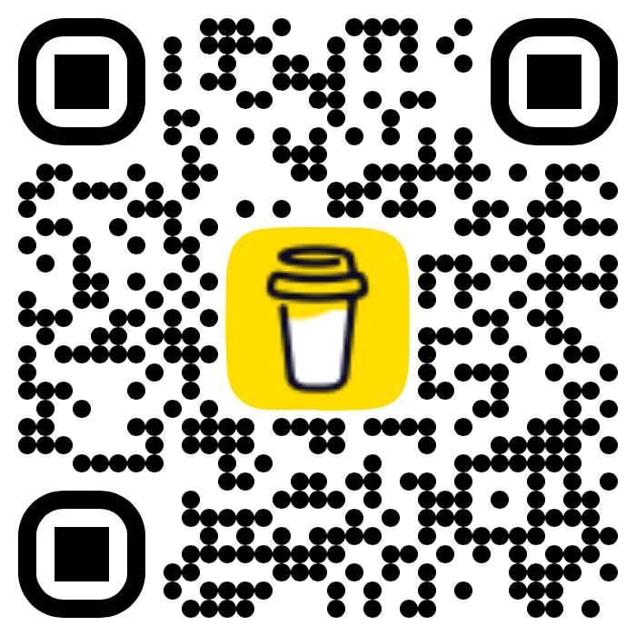

# Canvas App Gantt Chart
When discussiong programme or project management one of the most common visualisations is a gantt chart. This control takes a list of herarchical tasks and milestones.

## Features
### Timeline
The timeline display items by week. The header shows the number of weeks from the start of the gantt chart.

### Current Date Line
We will be developing this site with additional tools. If you have any suggestions please get in touch.

### Expanding
One of the control perameters allows for the table detail on the right hand side be expanded and collapsed.

## Technologies
- NodeJS
- React
- Power Platform CLI

## Screenshots

## Develop
1. Clone the repository
2. Make changes
3. Run build and open in browser

    npm run start

## Build and Deploy
1. Clone the repository
2. Run build

    npm run build

3. Ensure auth profile has been created and selected
4. publish the component solution to environment

    pac pcf push --publisher-prefix alex
    
## Run
Include the control following the [Microsoft Documentation](https://learn.microsoft.com/en-us/power-apps/developer/component-framework/component-framework-for-canvas-apps#add-components-to-a-canvas-app)

Note: include dates as UTC Text format in the items.
Note: include the column mapping in the advanced pannel of the control.

## Donate
Please consider donating to help us develop more great content at [Buy Me a Coffee](https://www.buymeacoffee.com/alexbakerwong).

